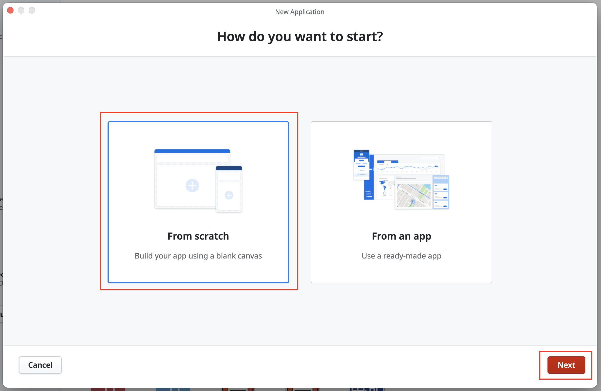
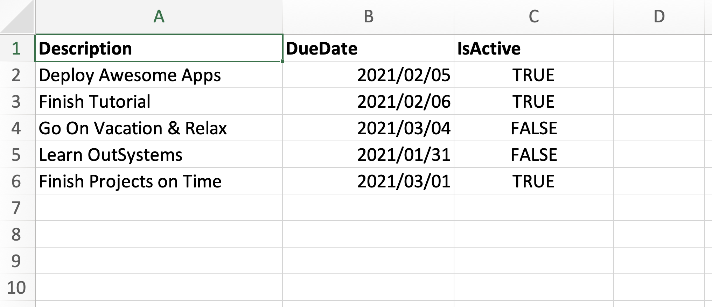
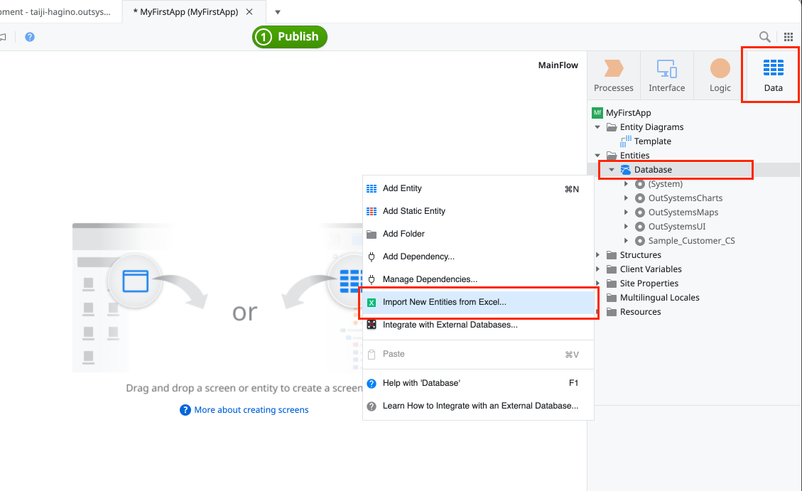
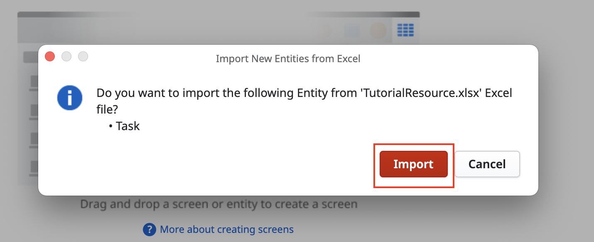

# OutSystems101

💡 OutSystemsをこれから使う方、使い始めたばかりの方向けのTipsシリーズです 💡

## はじめに
はじめてOutSystemsを使う方は、このチュートリアルから始めてみましょう！
リスト画面と詳細画面という2画面構成の、かんたんなタスク管理アプリケーションです。

本チュートリアルはService StudioのHelpメニューから「Build an App in 5 min tutorial」を選択することで、ガイドのウィザードを起動できます。
Service Studioのメニューから実施するチュートリアルはモバイルアプリですが、こちらではReactive Web Appバージョンで作成していきます。

## 事前準備
OutSystems PE(Personal Edition)アカウント作成（無料）
https://outsyste.ms/3LshMqW

## Service Studioの起動
1. 事前準備でインストールしたOutSystemsの統合開発環境（Service Studioといいます）を起動します。

2. 自分のOutSystems環境へログインします。

3. Service Studioが起動されたことを確認します。

## 新規アプリケーションの作成

1. Service Studioで [New Application] をクリックします。

2. [From scratch] を選択して [Next] ボタンをクリックします。今回はスクラッチで開発しますが、予め用意したテンプレートをベースにアプリを構築することも可能です。

3. [Reactive Web App] を選択して [Next] ボタンをクリックします。ここでのReactive Web AppとはReactで作られたWebアプリのことです。

4. 任意のアプリ名を設定します。このチュートリアルでは [MyFirstApp] としています。アプリ名を設定したら [Create App] ボタンをクリックします。

5. 下図のようなアプリケーション画面が表示されればOKです。

## モジュールの開発

OutSystemsでは、アプリケーションというプロジェクトの中に、モジュールと呼ばれるプログラムの実態がぶら下がる形でアプリケーションが構成されます。

* モジュールについてもっと知りたい方は[こちら](https://success.outsystems.com/ja-jp/Documentation/11/Developing_an_Application)をご覧ください。

1. ここでは、Reactive Web Appとしてアプリを開発するので、実装するモジュールのタイプが [Reactive Web App] となっていることを確認し [Create Module] ボタンをクリックします。

UI（画面）を作成するにあたり、画面から操作する対象のデータモデルを作成します。これはデータベースとテーブルにあたるものです。
OutSystemsでは、UIを作成するアプローチとして、スクラッチから作成、テンプレートをベースに作成、データモデルから自動生成、といった大きく3つの方法が存在します。
今回は、この中のデータモデルから自動生成する方法をやっていきましょう。これは通常スキャフォールディングと呼ばれます。

2. 今回のアプリで使う[データモデルの定義ファイル](./resources/TutorialResource.xlsx)を手元にダウンロードします。

定義ファイルはExcelで、内容はこのようになっています。

3. Service StudioのDataタブを選択し [Database] を右クリック、メニューから [Import New Entities from Excel...] を選択します。

4. 先程の手順で手元にダウンロードしたExcelファイルを選択し、Improtします。

5. Service StudioのDatabaseの下に [Task] という名前のエンティティ（データベースのテーブル）と、必要最低限のCRUDの処理（メソッド）が作成されていることが確認できます。

6. スキャフォールディングの機能を使ってUI（画面）を作成します。 Service Studioのワークスペースが [MainFlow] になっていることを確認します。 [Data] タブから先程作成した [Task] エンティティをワークスペース上へドラッグドロップします。

7. 画面が2つ作成され、線でつながれていることが確認できます。この2つの画面は、Taskエンティティを元に、そのデータの一覧画面（リスト画面）と詳細画面（編集・新規登録画面）になります。 OutSystemsではエンティティのデータ内容を自動認識して、一覧画面と詳細画面を自動で作成し、ボタン押下時の処理（データベースへのデータ更新、取得など）も自動で実装してくれます。

8. 画面を確認します。それぞれの画面はダブルクリックでレイアウトを確認することができます。 必要であれば、自分好みにカスタマイズすることも可能です。

一覧画面のレイアウト編集モード

詳細画面のレイアウト編集モード

## アプリケーションのパブリッシュ

OutSystemsでは、ローカルマシン上のService Studioで作成したアプリケーションを、パブリッシュすることでロジックチェック→ビルド/コンパイル→実行環境へのデプロイまで一気に行ってくれます。
本チュートリアルを実施しているタイミングでは、おそらくみなさんはPersonal Environment（PE）という無料アカウントをお使いだと思います。PEの場合は、アプリケーションのデプロイ先はOutSystemsが提供しているOutSystemsクラウドになります。
スタンダードライセンス、エンタープライズライセンスをお使いの場合は、任意のクラウドインフラやオンプレにOutSystems環境を構築することで、そちらへアプリケーションをデプロイすることが可能です。

1. Servie Studio上の [1Click Publish] ボタンをクリックします。

2. 全てのパブリッシュプロセスが完了すると、対象のアプリケーションがAvailableになったことをお知らせするメッセージがServie Studio上に表示されます。

3. Servie Studio上の [1Click Publish] ボタンが青色の [Open in browzer] ボタンに変わっているので、これをクリックします。

4. ブラウザが開き、作成したアプリケーションが表示されました。

一覧画面

編集画面（詳細画面）

新規登録画面（詳細画面）

## さいごに
おつかれさまでした。これでOutSystemsを使い始めるためのチュートリアルは完了です。 すでに基本は学びましたので、応用編としていろいろなアプリ作成を試してみてください。
OutSystemsでは、定期的にJump Startというハンズオンワークショップを行っていますので、ご興味ある方はこちらもチェックしてみてくださいね！

[OutSystems Jump Start - Japan](https://www.outsystems.com/ja-jp/events/jump-start/apac/japan/)

また、社内向けなど個別にハンズオンワークショップや、OutSystemsを使ったハッカソンをご希望の方は以下までご連絡ください！

### 萩野たいじ
Developer Advodate/Community Manager at OutSystems
taiji.hagino@outsystems.com
[Twitter](https://twitter.com/taiponrock)
[LinkedIn](https://www.linkedin.com/in/taiponrock/)
